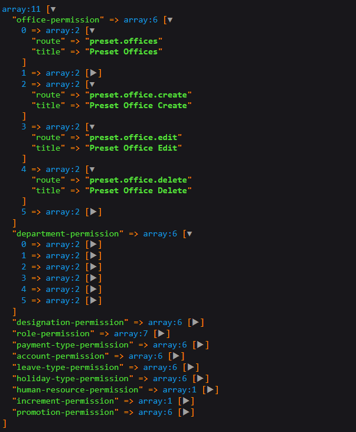

# Laravel Permission Name Generator
[](https://packagist.org/packages/radiatecode/laravel-route-permission)
[](https://packagist.org/packages/radiatecode/laravel-route-permission)

This package will generate permission names from route names. Permissions  are grouped by controller name. These permission names can be usefull for authorization (role-permission base system)

## Example
### Generate permission view


**In controller:**

```php
class RoleController extends Controller
{
    public function permissionsShow($id)
    {
        $role = Role::query()->findOrFail($id);

        return PermissionsView::withRolePermissions(
            $role->role_name,
            json_decode($role->role_permissions), // assume role permissions stored as json encoded
            route('create-role-permission', $role->id) // permission save url for a role
        )->view('app.role.permissions');
    }
}
```
**In view (blade) file:**
```html
<div class="permissions">
    {!! $permissionCards !!}
</div>

......
<!-- generate scripts -->
{!! $permissionScripts !!}
```
**Saving permissions for a role:**
```php
Route::post('/role/{id}/permissions/create',[RoleController::class,'permissionStore'])->name('create-role-permission');
```
```php
use \Illuminate\Http\Request;
class RoleController extends Controller
{
     public function permissionStore(Request $request,$id)
    {
        $role = Role::find($id);

        $role->role_permissions = json_encode($request->get('permissions')); // get the submitted permissions
        $role->save();

        return response()->json('success',201);
    }
}
```
# Requirements
- [PHP >= 7.1](https://www.php.net/)
- [Laravel 5.7|6.x|7.x|8.x](https://github.com/laravel/framework)
- [JQuery](https://jquery.com/)
- [Bootstrap](https://getbootstrap.com/)
# Installation
You can install the package via composer:

    composer require radiatecode/laravel-permission-name-generator

Publish config file

    php artisan vendor:publish --provider="RadiateCode\PermissionNameGenerator\PermissionNameServiceProvider" --tag="permission-generator-config"

Publish default permission view files (optional)

        php artisan vendor:publish --provider="RadiateCode\PermissionNameGenerator\PermissionNameServiceProvider"

# Usage

## PermissionGenerator trait [Optional]
While this package generate permission names from route names, in some cases we might need to exclude some permission names. To do so implement the **WithPermissionGenerator** contracts in the controller, then use the **PermissionGenerator** trait. We can use `permissionExcludeMethods()` to exclude permissions by route associative method. We can also define permission group name `permissionGroupTitle()`. 

```php
use App\Http\Controllers\Controller;
use RadiateCode\LaravelRoutePermission\Contracts\WithPermissionGenerator;
use RadiateCode\LaravelRoutePermission\Traits\PermissionGenerator;

class OfficeController extends Controller implements WithPermissionGenerator
{
    use PermissionGenerator;
   
    public function __construct()
    {
         $this->permissionGroupTitle('Office Crud Permission')
            ->permissionExcludeMethods('index','listDatatable'); // when necessary exclude specific routes by the controller methods
    }
}
```

> **PermissionGenerator** trait is optional. Because if no permissible title defined, then this package dynamically generate a title based on controller name, And routes/permissions can be excluded in the config file.

## Get Permissions

You can get permissible routes And make your own permissions view in order to set role permissions.

    RadiateCode\PermissionNameGenerator\Permissions::make()->get();

**Output**



> Under the hood it gets all the routes which registered in **web.php** and only take those routes which has permission middleware. The permissible routes grouped by controller.

## Permission View Builder Facade
If you don't want to make permission view by your own, then you can use predefined permissions view [**PermissionViewBuilder** facade]. 

See the above [example](#example)

**Builder methods:**

- permissionView() : generate bootstrap permissions card based on permissible routes, and config defined action buttons.
- withRolePermissions($roleName,$rolePermissions) : it is used to select all the permissions that have access to a particular role.
- permissionScripts($url = null) : generate functions for check all and uncheck all buttons. The **$url** param used to submit the selected permissions for specific role.

> **Note:** When submit the permissions from predefined view to any post routes you need to get the permissions by 
> ```php
>   $request->get('permissions');  // array of permissions
> ```


## Configuration

Config the **config/route-permission.php** file.

Define the name of the permission middlewares. The package recognise the route as permissible route by these middlewares.
```php
/**
 * Permission middlewares
 *
 * [nt: define the middlewares by which we applied permissions]
 */
'permission-middlewares' => [
    // 'auth', 'role-permissions'
],
```
If route name contains any special char then split the the name by that char. It will use to generate route title. For example if route name is **create.designation** then it's title would be **Create Designation**
```php
/**
 * Split route name by defined character
 */
'route-name-splitter' => '.',
```
Exclude routes by route name. If we don't want to include any routes as permissible routes then we can exclude those in here.
```php
/**
 * Exclude routes by route name
 */
'exclude-routes' => [
    // route.name
],
```
Exclude routes by controller. If we want to exclude all routes of a controller then we can exclude it here

```php
/**
 * Exclude routes by controller
 *
 * [NT: We can exclude routes by controllers. All the routes associated with controller will be excluded]
 */
'exclude-controllers' => [
    /**
     * exclude every route which associate with WelcomeController
     */
    // WelcomeController::class
],
```
Caching the permissible routes
```php
/**
 * Cache the permissible routes
 */
'cache-routes' => [
  'cacheable' => true,
  'cache-driver' => env('CACHE_DRIVER', 'file')
],
```
Buttons generate in the permission view
```php
/**
 * permission button used to checked / unchecked all routes
 * and save permissions for a particular role
 *
 * nt: extra button can be added
 */
'permission-buttons' => [
    '<button type="button" class="btn btn-primary" onclick="checkAll()"><i class="fa fa-check-square"></i> Check All</button>',
    '<button type="button" class="btn btn-warning" onclick="uncheckAll()"><i class="fa fa-square"></i> Uncheck All </button>',
    '<button type="button" class="btn btn-success save-btn" onclick="saveRolePermissions()" title="save role permission"><i class="save-loader fa fa-save"></i> Save </button>',
],
```
Permission card size (bootstrap grid)
```php
/**
 * Permission card size
 *
 * [nt: permissible card only works on bootstrap]
 */
'card-size-class' => 'col-md-3 col-lg-3 col-sm-12',
```
## Contributing
Please see [CONTRIBUTING](CONTRIBUTING.md) for details.

## Security
If you discover any security related issues, please email [radiate126@gmail.com](mailto:radiate126@gmail.com) instead of using the issue tracker. 

## Credits
- [Noor Alam](https://github.com/radiatecode)
- [All Contributors](https://github.com/radiatecode/laravel-route-permission/contributors)


## License

The MIT License (MIT). Please see [License File](LICENSE.md) for more information.

