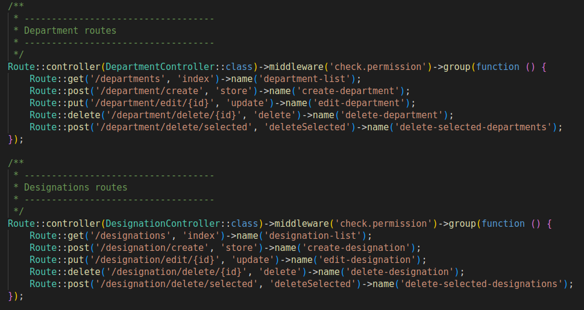
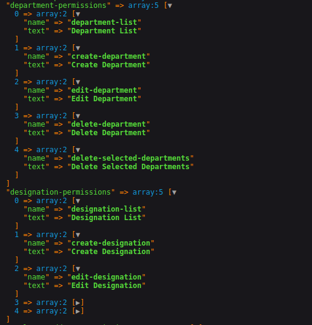
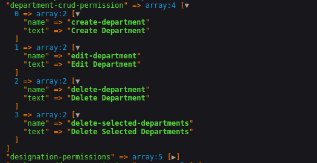
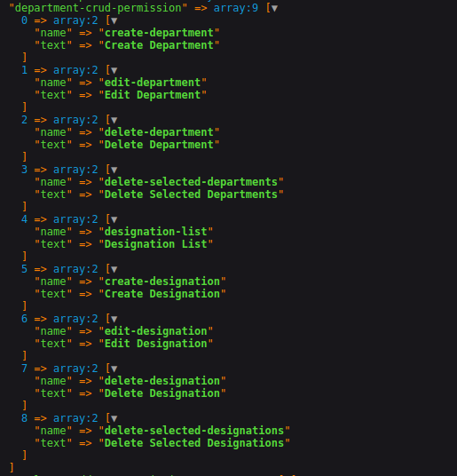
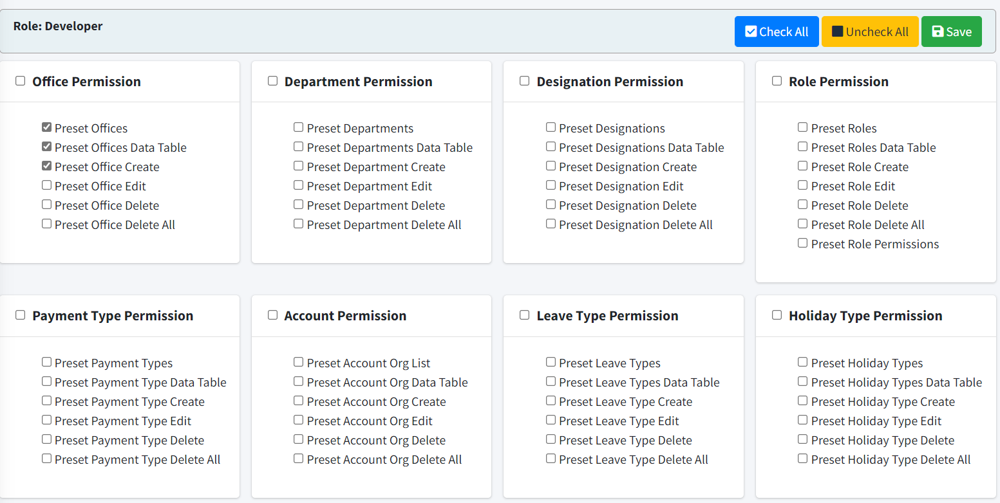

# Laravel Permission Name Generator
[](https://packagist.org/packages/radiatecode/laravel-permission-name-generator)
[](https://packagist.org/packages/radiatecode/laravel-permission-name-generator)

This package will generate permission names from route names or resources. In many application we create static permission names (ex: create-post, edit-post, delete-post) to check user's accessability, using the package can helps you to generate permission names dynamically.
# Requirements
- [PHP >= 7.1](https://www.php.net/)
- [Laravel 5.7|6.x|7.x|8.x|9.x|10.x](https://github.com/laravel/framework)
- [JQuery](https://jquery.com/) [for view]
- [Bootstrap](https://getbootstrap.com/) [for view]
# Installation
You can install the package via composer:

    composer require radiatecode/laravel-permission-name-generator

**Publish config file**

    php artisan vendor:publish --provider="RadiateCode\PermissionNameGenerator\PermissionNameServiceProvider" --tag="permission-generator-config"

**Publish permission view files (optional)**

    php artisan vendor:publish --provider="RadiateCode\PermissionNameGenerator\PermissionNameServiceProvider" --tag="permission-views"
> It can be usefull when you want to customise the permissions view
# Usage

Here are some routes


### Now get permissions names from that routes

    RadiateCode\PermissionNameGenerator\Permissions::make()->fromRoutes()->get();

**Output**


## PermissionGenerator trait [Optional]
From controller if you want to set prmission group title, excluded permissions or append permissions to another group then the trait becomes handy. How we use it, implement the **WithPermissionGenerator** contracts in the controller, then use the **PermissionGenerator** trait. 

Available methods in **PermissionGenerator** trait

- `permissionExcludeMethods()` : use to exculde a route from being generated as permission name.
- `permissionGroupTitle()`: Use to set permission group title
- `permissionAppendTo()`: Permissions append to another permission group

**Example**
```php
use App\Http\Controllers\Controller;
use RadiateCode\LaravelRoutePermission\Contracts\WithPermissionGenerator;
use RadiateCode\LaravelRoutePermission\Traits\PermissionGenerator;

class DepartmentController extends Controller implements WithPermissionGenerator
{
    use PermissionGenerator;
   
    public function __construct()
    {
         $this->permissionGroupTitle('Department Crud Permissions')
            ->permissionExcludeMethods('index');// index associate route won't be generated as permission names
    }
}
```
Output:



**Permission Append Example:**
```php
use App\Http\Controllers\Controller;
use App\Http\Controllers\Controller\DepartmentController;
use RadiateCode\LaravelRoutePermission\Contracts\WithPermissionGenerator;
use RadiateCode\LaravelRoutePermission\Traits\PermissionGenerator;

class DesignationController extends Controller implements WithPermissionGenerator
{
    use PermissionGenerator;
   
    public function __construct()
    {
        $this->permissionAppendTo(DepartmentController::class);
    }
}
```
Output:



> **PermissionGenerator** trait is optional. Because if no permission group title defined, then this package dynamically generate a title based on controller name, routes can be excluded in the [config](#configuration), and permission append can be done by `custom-permission` [config](#configuration).

## Permission View Builder
The package comes with a view builder to show generated permission names in organised way.

**Builder available methods:**

- `make(string $view, array $data = [])`: set your view.
- `withPermissions(array $permissions)`: pass generated permission names.
- `markRolePermissions(string $roleName,arra $rolePermissions,string $permissionsSaveUrl = null)`: This method helps you to mark the stored role's permissions, you can define a url where you can store/update the permissions of the role
- `render()`: it render the view along with predefined data ($permissionCards, $permissionScripts), display these data in your blade. See the blade file example below

### Submiting permissions can be get by

> ```php
>   $request->get('permissions');  // array of permissions
> ```

### Example of permission view
**In controller:**

```php
use RadiateCode\PermissionNameGenerator\Permissions;
use RadiateCode\PermissionNameGenerator\Facades\PermissionsView;
use App\Models\Role;

class RoleController extends Controller
{
    public function permissionsShow($id)
    {
        $role = Role::query()->findOrFail($id);

        // generate permissions from routes
        $permissions = Permissions::make()->fromRoutes()->get();
        
        return PermissionsView::make('app.role.permissions')
            ->withPermissions($permissions) 
            ->markRolePermissions( // helps to mark the stored role's permissions in the view
                $role->role_name,
                json_decode($role->role_permissions), // assume role permissions stored as json encoded
                route('create-role-permission', $role->id) // permission save url for a role
            )->render();
    }
}
```
**In app/role/permissions.blade.php file:**
```html
@extends('demo.layouts.app')

@section('content')
    <div class="row">
        <div class="col-12">
            <div class="card card-dark">
                <div class="card-header">
                    <h3 class="card-title">Role Permissions</h3>
                </div>
                <div class="card-body">
                    <!-- Comes from PermissionView Builder -->
                    {!! $permissionCards !!} 
                </div>
            </div>
        </div>
    </div>
@endsection

@push('js')
    <!-- Comes from PermissionView Builder -->
    {!! $permissionScripts !!}
@endpush
```

**Permissions view**



**Create the permission savings route**

```php
Route::post('/role/{id}/permissions/create',[RoleController::class,'permissionStore'])->name('create-role-permission');
```
```php
use \Illuminate\Http\Request;
class RoleController extends Controller
{
     public function permissionStore(Request $request,$id)
    {
        $role = Role::find($id);

        $role->role_permissions = json_encode($request->get('permissions')); // get the submitted permissions
        $role->save();

        return response()->json('success',201);
    }
}
```

## Configuration

Config the **config/permission-generator.php** file.

### 1. Splitter
If route name contains any special char then split the name by that char. It will use to generate permission text. For example if route name is **create.post** then permission text would be **Create Post**
```php
/**
 * Split route name by defined needle
 */
'route-name-splitter-needle'    => '.',
```
### 2. Custom Permissions
You can defined custom new permissions, add extra permissions to existing one.
```php
/**
 * Custom permissions
 */
'custom-permissions'  => [
    //
],
```
> Example 
> ```php
> 'custom-permissions' = [
>    'user-permission' => ['active-user','inactive-user'],
>    'bonus-permission' => [
>        [
>          'name' => 'approve-own-department',
>          'text' => 'Approve Own Department'
>        ],
>    ]
> ]
>
>```
> Note: notice the `user-permission` key which contains only permission name, if no text key pass the package dynamically make a text for the permission name. You can also add extra permissions to exisiting permission, for example `bonus-permission` is an exisitng permission, we add custom `approve-own-department` extra permission to it.
>
### 3. Permission Generate Controllers
From which controller's routes permission names will be generate, define it here. This config play vital role to generate permissions because permissions will be generated only for defined controllers. 

```php
/**
 * Permission generate controller's namespace
 *
 * By Default permission names will be generated from all controller's routes
 */
'permission-generate-controllers' => [
    'App\Http\Controllers',

    // sample
    // 'App\Http\Controllers\Api',
    // App\Http\Controllers\DepartmentController::class,
    // App\Http\Controllers\DesignationController::class,
],
```
### 4. Exclude Routes
Exclude routes by defining controller namespace. Here auth and EmployeeProfileController related routes will be excluded from being generated as permission names.

```php
 /**
 * Exclude routes by controller's namespace
 */
'exclude-controllers'           => [
    'App\Http\Controllers\Auth', // exclude routes of all auth controllers

    // sample
    App\Http\Controller\Employee\EmployeeProfileController::class, // exclude routes of EmployeeProfileController
],
```

**Or,** we can exclude routes by route name

```php
 /**
 * Exclude routes by route name
 */
'exclude-routes'                => [
    // sample
    'register.user',
    'employee.profile',
    ....
    ....
],
```
### 6. Cache Permissions
Caching the permission names

```php
/**
 * Cache the rendered permission names
 */
'cache-permissions'             => true,
```
### 7. Permissions Section
Permissions can be organised by section, example admin section, employee section, settings setion etc.
```php
/**
 * Parmissions can be organised by section (ex: adminland, settings, employee managment etc)
 * 
 * sample format: key as section name, value as generated permissions-title
 * [
 *   'adminland' => [
 *       'employee-permissions',
 *       'bonus-permissions'
 *   ],
 *   'settings' => [
 *       'office-permissions',
 *       'designation-permissions',
 *       'email-settings-permissions',
 *       'rules-permissions'
 *   ],
 *  ]
 */
'permissions-section' => [
    // sample
    'admin' => [
        'users-permissions',
        'roles-permissions'
    ],
    'settings' => [
        'email-settings-permissions',
        RuleController::class, // if permission is from routes
        NotificationController::class // if permission is from routes
    ],
    ......,
    ......,
]
```

## Alternatively generate Permissions
The package allows you to generate permission names by defining resource names.

**Example**
```php
use RadiateCode\PermissionNameGenerator\Permissions;

$permissions = Permissions::make()->fromResources([
    'users',
    'posts',
])->get()

// output
[
    'users-permission' => [
        [
            'name' => 'create-users',
            'text' => 'Create Users'
        ],
        [
            'name' => 'edit-users',
            'text' => 'Edit Users'
        ],
        [
            'name' => 'show-users',
            'text' => 'Show Users'
        ],
        [
            'name' => 'delete-users',
            'text' => 'Delete Users'
        ],
        [
            'name' => 'view-users',
            'text' => 'View Users'
        ],
    ],
    'posts-permission' => [
        [
            'name' => 'create-posts',
            'text' => 'Create Posts'
        ],
        [
            'name' => 'edit-posts',
            'text' => 'Edit Posts'
        ],
        [
            'name' => 'show-posts',
            'text' => 'Show Posts'
        ],
        [
            'name' => 'delete-posts',
            'text' => 'Delete Posts'
        ],
        [
            'name' => 'view-posts',
            'text' => 'View Posts'
        ],
    ]
]
```
> Wonder how it generate, the resource permission names generate using actions, which defined in the `config` file
> ```php
>  /**
>  * These actions used to generate permissions on given resources
>  * 
>  * [Ex: If resource is posts, then permission will be ('create-posts','edit-posts','view-posts') etc]
>  */
> 'resource-actions' => [
>    'create',
>    'edit',
>    'show',
>    'delete',
>    'view',
>]

**we can also add resource wise extra actions, which will generate extra permission names.**

```php
use RadiateCode\PermissionNameGenerator\Permissions;

$permissions = Permissions::make()->fromResources([
    'users' => /*extra actions*/['delete-selected','active'], 
    'posts' // no extra actions
])->get();

// output
[
    'users-permission' => [
        [
            'name' => 'create-users',
            'text' => 'Create Users'
        ],
        [
            'name' => 'edit-users',
            'text' => 'Edit Users'
        ],
        [
            'name' => 'show-users',
            'text' => 'Show Users'
        ],
        [
            'name' => 'delete-users',
            'text' => 'Delete Users'
        ],
        [
            'name' => 'view-users',
            'text' => 'View Users'
        ],
        [ // extra
            'name' => 'delete-selected-users',
            'text' => 'Delete Selected Users'
        ],
        [ // extra
            'name' => 'active-users',
            'text' => 'Active Users'
        ],
    ],
    'posts-permission' => [
        [
            'name' => 'create-posts',
            'text' => 'Create Posts'
        ],
        [
            'name' => 'edit-posts',
            'text' => 'Edit Posts'
        ],
        [
            'name' => 'show-posts',
            'text' => 'Show Posts'
        ],
        [
            'name' => 'delete-posts',
            'text' => 'Delete Posts'
        ],
        [
            'name' => 'view-posts',
            'text' => 'View Posts'
        ],
    ],
]
```

### Permission View Builder
**Example**
```php
use RadiateCode\PermissionNameGenerator\Permissions;
use RadiateCode\PermissionNameGenerator\Facades\PermissionsView;
use App\Models\Role;

class RoleController extends Controller
{
    public function permissionsShow($id)
    {
        $role = Role::query()->findOrFail($id);

        $permissions = Permissions::make()->fromResources([
                'users',
                'posts',
                'comments'
            ])->get();

        return PermissionsView::make('app.role.permissions')
            ->withPermissions($permissions)
            ->markRolePermissions(
                $role->role_name,
                json_decode($role->role_permissions), // assume role permissions stored as json encoded
                route('create-role-permission', $role->id) // permission save url for a role
            )->render();
    }
}
```

## Contributing
Please see [CONTRIBUTING](CONTRIBUTING.md) for details.

## Security
If you discover any security related issues, please email [radiate126@gmail.com](mailto:radiate126@gmail.com) instead of using the issue tracker. 

## Credits
- [Noor Alam](https://github.com/radiatecode)
- [All Contributors](https://github.com/radiatecode/laravel-route-permission/contributors)


## License

The MIT License (MIT). Please see [License File](LICENSE.md) for more information.

